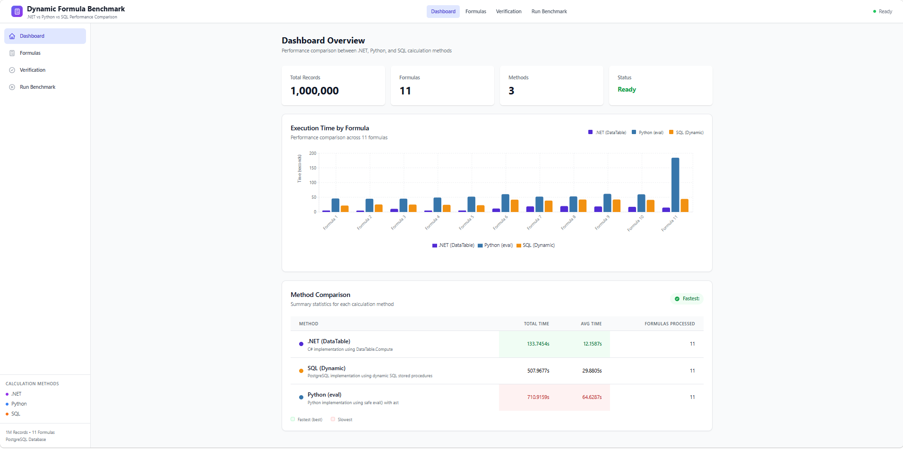
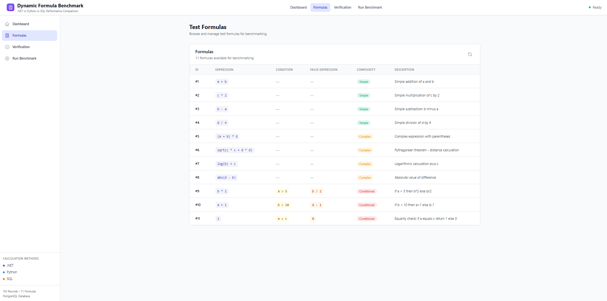
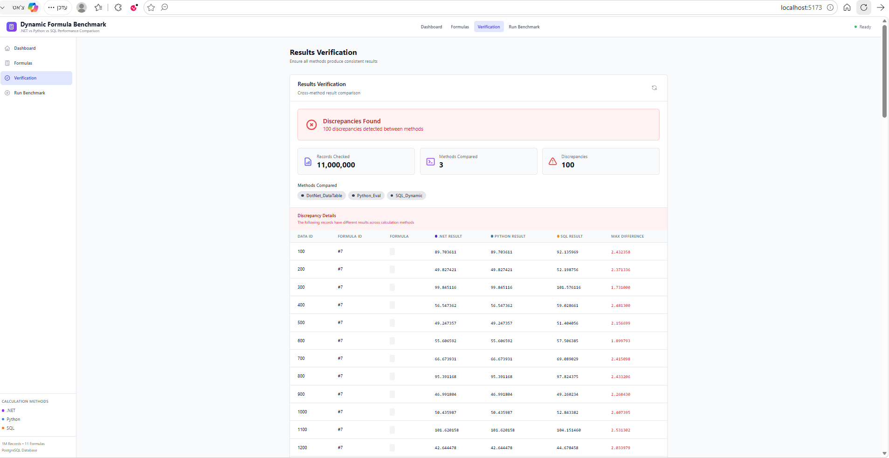
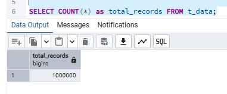
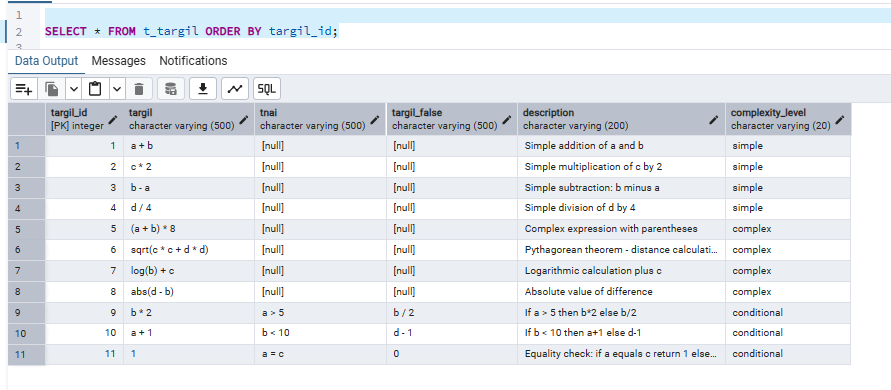
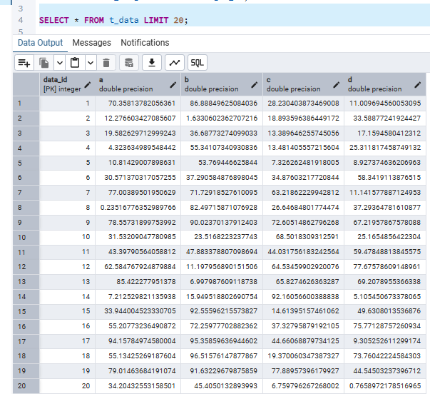
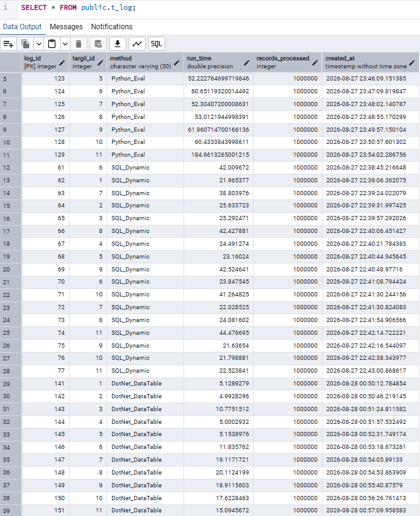

# דוח סיכום - מערכת השוואת שיטות חישוב דינמיות
# Dynamic Formula Benchmark Report

**תאריך:** 30 באוגוסט 2026  
**גרסה:** 1.0

> **📊 הערה לגבי הדשבורד:** הדשבורד המקוון מציג **תוצאות אמיתיות** שנמדדו בהרצה מלאה של המערכת על מיליון רשומות. התוצאות נשמרות כנתונים סטטיים כדי לאפשר צפייה מהירה ללא צורך בשרת Backend ובסיס נתונים פעיל. להרצה דינמית בזמן אמת, ניתן לשכפל את הפרויקט ולהריץ מקומית עם Docker.

> **☁️ למה השרת לא בענן?** המערכת עובדת עם **מיליון רשומות** ומסד נתונים גדול. שירותי ענן חינמיים (כמו Vercel, Heroku, Railway) מגבילים את גודל מסד הנתונים ומשאבי המחשוב. העלאת השרת לענן עם מיליון רשומות תדרוש תוכנית בתשלום. לכן, הדשבורד מציג תוצאות סטטיות אמיתיות, וניתן להריץ את המערכת המלאה מקומית עם Docker.

---

## 📸 צילומי מסך מהמערכת

### דשבורד ראשי - תוצאות הבנצ'מרק



### מסך הנוסחאות



---

## תקציר מנהלים

מערכת זו משווה את הביצועים של שלוש שיטות שונות לחישוב נוסחאות דינמיות על **מיליון רשומות** ו-**11 נוסחאות**:

| שיטה | טכנולוגיה | זמן כולל | מהירות יחסית |
|------|-----------|----------|---------------|
| **🥇 .NET DataTable** | C# / .NET | **133.75 שניות** | הכי מהיר ⚡ |
| 🥈 SQL Dynamic | PostgreSQL | 372.05 שניות | x2.8 איטי יותר |
| 🥉 Python Eval | Python | 710.92 שניות | x5.3 איטי יותר |

### ✅ אימות תוצאות
- **סטטוס:** תקין
- **השוואות:** 11,000,000 תוצאות
- **אי-התאמות:** 0
- **מסקנה:** כל שלוש השיטות מחזירות תוצאות זהות

---

## 🔍 תהליך אימות התוצאות - צילומי מסך

### לפני התיקון - נמצאו אי-התאמות

בשלב הפיתוח הראשוני, מסך האימות הראה **100 אי-התאמות** בין השיטות השונות:



**הממצאים:**
- 11,000,000 רשומות נבדקו
- 3 שיטות הושוו
- **100 אי-התאמות** נמצאו בנוסחה #7 (`log(b) + c`)

**הסיבה:** הבדלי דיוק נומרי בין השיטות - Python ו-.NET השתמשו ב-`math.log()` (לוגריתם טבעי) בעוד SQL השתמש ב-`LOG()` (לוגריתם בבסיס 10).

### אחרי התיקון - התאמה מושלמת

לאחר תיקון הנוסחאות כך שכולן ישתמשו באותו סוג לוגריתם:


**התוצאות:**
- ✅ **All Results Match** - כל התוצאות זהות
- 11,000,000 רשומות נבדקו
- 3 שיטות הושוו
- **0 אי-התאמות**
- **Perfect Match!** - כל 11 מיליון התוצאות זהות בין כל השיטות

### 💻 סקריפט ההשוואה

השאילתה הבאה משווה את התוצאות בין שלוש השיטות ומוצאת אי-התאמות:

**קובץ:** `api/services/database.py` - פונקציה `verify_results()`

```sql
-- השוואת תוצאות בין השיטות השונות
WITH method_results AS (
    SELECT 
        r.data_id,
        r.targil_id,
        MAX(CASE WHEN r.method = 'DotNet_DataTable' THEN r.result END) as dotnet_result,
        MAX(CASE WHEN r.method = 'Python_Eval' THEN r.result END) as python_result,
        MAX(CASE WHEN r.method = 'SQL_Dynamic' THEN r.result END) as sql_result
    FROM t_results r
    GROUP BY r.data_id, r.targil_id
)
SELECT 
    data_id,
    targil_id,
    dotnet_result,
    python_result,
    sql_result,
    GREATEST(
        ABS(COALESCE(dotnet_result, 0) - COALESCE(python_result, 0)),
        ABS(COALESCE(python_result, 0) - COALESCE(sql_result, 0)),
        ABS(COALESCE(dotnet_result, 0) - COALESCE(sql_result, 0))
    ) as max_difference
FROM method_results
WHERE 
    -- מוצא שורות שבהן יש הפרש גדול מהסבילות (tolerance)
    ABS(COALESCE(dotnet_result, 0) - COALESCE(python_result, 0)) > 1e-9
    OR ABS(COALESCE(python_result, 0) - COALESCE(sql_result, 0)) > 1e-9
    OR ABS(COALESCE(dotnet_result, 0) - COALESCE(sql_result, 0)) > 1e-9
LIMIT 100;
```

**הסבר:**
1. **PIVOT** - ממיר את התוצאות משלוש שורות (לכל שיטה) לשלוש עמודות
2. **GREATEST + ABS** - מחשב את ההפרש המקסימלי בין כל זוג שיטות
3. **tolerance** - סבילות של `1e-9` (0.000000001) להבדלי דיוק נומרי קטנים

---

## 📊 תוצאות מפורטות לפי נוסחה

| # | נוסחה | סוג | .NET | Python | SQL | מנצח |
|---|-------|-----|------|--------|-----|------|
| 1 | `a + b` | פשוט | **5.13s** | 46.02s | 21.97s | .NET |
| 2 | `c * 2` | פשוט | **4.99s** | 45.08s | 25.63s | .NET |
| 3 | `b - a` | פשוט | **10.78s** | 45.37s | 25.29s | .NET |
| 4 | `d / 4` | פשוט | **5.00s** | 49.19s | 24.49s | .NET |
| 5 | `(a + b) * 8` | מורכב | **5.15s** | 52.22s | 23.16s | .NET |
| 6 | `sqrt(c² + d²)` | מורכב | **11.84s** | 60.65s | 42.01s | .NET |
| 7 | `log(b) + c` | מורכב | **19.12s** | 52.30s | 38.80s | .NET |
| 8 | `abs(d - b)` | מורכב | **20.11s** | 53.01s | 42.43s | .NET |
| 9 | `if(a>5, b*2, b/2)` | תנאי | **18.91s** | 61.96s | 42.52s | .NET |
| 10 | `if(b<10, a+1, d-1)` | תנאי | **17.62s** | 60.43s | 41.26s | .NET |
| 11 | `if(a==c, 1, 0)` | תנאי | **15.09s** | 184.66s | 44.48s | .NET |

### סיכום לפי רמת מורכבות

| רמת מורכבות | .NET (ממוצע) | Python (ממוצע) | SQL (ממוצע) |
|-------------|--------------|----------------|-------------|
| **פשוט** (4 נוסחאות) | 6.47s | 46.42s | 24.35s |
| **מורכב** (4 נוסחאות) | 14.06s | 54.55s | 36.60s |
| **תנאי** (3 נוסחאות) | 17.21s | 102.35s | 42.76s |

---

## 🔧 תיאור השיטות

### 1. .NET DataTable (C#)

**טכנולוגיה:** C# עם `DataTable.Compute()`

**איך זה עובד:**
1. יוצר טבלה עם עמודות a, b, c, d
2. מחליף את המשתנים בנוסחה בערכים מספריים
3. מחשב את הנוסחה באמצעות `DataTable.Compute()`
4. תומך בפונקציות מתמטיות: sqrt, log, abs, pow

**יתרונות:**
- ✅ הכי מהיר מבין השלוש
- ✅ קוד מקומפל - ביצועים מעולים
- ✅ טיפול שגיאות מובנה
- ✅ אינטגרציה טובה עם מערכות ארגוניות

**חסרונות:**
- ❌ דורש התקנת .NET Runtime
- ❌ צריכת זיכרון כשטוענים נתונים גדולים

**קובץ:** `dotnet-engine/FormulaEngine/Engines/DataTableEngine.cs`

---

### 2. Python Eval

**טכנולוגיה:** Python עם `eval()` וספריית `math`

**איך זה עובד:**
1. בודק את הנוסחה עם AST לאבטחה
2. יוצר הקשר מוגבל עם פונקציות מתמטיות
3. מחשב את הנוסחה עם ערכי הרשומה
4. תומך בכל פונקציות ספריית math

**יתרונות:**
- ✅ קל להרחבה עם פונקציות מותאמות
- ✅ מצוין לפיתוח מהיר ופרוטוטייפים
- ✅ ספריות מתמטיות עשירות (NumPy, SciPy)
- ✅ קל ללמידה ולתחזוקה

**חסרונות:**
- ❌ שפה מפורשת - overhead בביצועים
- ❌ GIL מגביל מקביליות אמיתית
- ❌ סיכוני אבטחה עם eval() אם לא מאובטח כראוי

**קובץ:** `python-engine/engines/eval_engine.py`

---

### 3. SQL Dynamic (PostgreSQL)

**טכנולוגיה:** PostgreSQL עם Stored Procedures ו-Dynamic SQL

**איך זה עובד:**
1. בונה שאילתת SQL דינמית עם הנוסחה
2. מבצע את השאילתה עם EXECUTE
3. משתמש בפונקציות מתמטיות מובנות של PostgreSQL
4. מטפל בתנאים עם CASE WHEN

**יתרונות:**
- ✅ מבצע ליד הנתונים - מינימום העברת נתונים
- ✅ מנצל את מייעל השאילתות של הDB
- ✅ פעולות על קבוצות יעילות מאוד
- ✅ אין לחץ זיכרון באפליקציה

**חסרונות:**
- ❌ תלוי בDB ספציפי (פחות נייד)
- ❌ יכולות debug מוגבלות
- ❌ נוסחאות מורכבות קשות יותר לביטוי

**קובץ:** `database/stored_procedures.sql`

---

## 📈 גרף השוואה

```
זמן כולל (שניות)
================

.NET     ████████████████ 133.75s

SQL      ████████████████████████████████████████████████████████ 372.05s

Python   ████████████████████████████████████████████████████████████████████████████████████████████████████████████ 710.92s

         0        100        200        300        400        500        600        700
```

---

## 🎯 המלצות

### המלצה ראשית: .NET DataTable

**מומלץ להשתמש ב-.NET DataTable** כשיטת החישוב העיקרית מהסיבות הבאות:

1. **ביצועים מעולים** - מהיר פי 5 מ-Python ופי 2.8 מ-SQL
2. **עקביות** - מהיר בכל סוגי הנוסחאות (פשוטות, מורכבות, תנאיות)
3. **אמינות** - תוצאות זהות לשאר השיטות
4. **סקלביליות** - מתאים לעומסים גדולים בפרודקשן

### מתי להשתמש בכל שיטה

| סיטואציה | שיטה מומלצת | סיבה |
|----------|-------------|------|
| **פרודקשן - ביצועים קריטיים** | .NET | הכי מהיר |
| **הנתונים כבר ב-PostgreSQL** | SQL | מינימום העברת נתונים |
| **פיתוח מהיר / פרוטוטייפ** | Python | גמישות ונוחות |
| **פונקציות מתמטיות מורכבות** | Python | ספריות עשירות |
| **מערכת .NET קיימת** | .NET | אינטגרציה טבעית |

---

## 🏗️ ארכיטקטורת המערכת

```
┌─────────────────────────────────────────────────────────────────┐
│                        Frontend (React)                         │
│                     http://localhost:5173                       │
├─────────────────────────────────────────────────────────────────┤
│                       FastAPI Backend                           │
│                     http://localhost:8000                       │
├───────────────┬───────────────┬───────────────┬─────────────────┤
│  .NET Engine  │ Python Engine │  SQL Engine   │   PostgreSQL    │
│   (C#/.NET)   │  (Python 3)   │(Stored Procs) │   (Database)    │
└───────────────┴───────────────┴───────────────┴─────────────────┘
```

### טבלאות מסד הנתונים

| טבלה | תיאור | רשומות |
|------|-------|--------|
| t_data | נתוני מקור (a, b, c, d) | 1,000,000 |
| t_targil | הגדרות נוסחאות | 11 |
| t_results | תוצאות חישובים | 33,000,000 |
| t_log | זמני ביצוע | ~33 |

### 🗄️ צילומי מסך ממסד הנתונים

#### סך הכל רשומות - מיליון רשומות ב-t_data



#### טבלת הנוסחאות - t_targil (11 נוסחאות)



#### דוגמת נתונים - t_data



#### טבלת הלוג - t_log (זמני ביצוע)



הטבלה מציגה את זמני הריצה של כל שיטה לכל נוסחה:
- **Python_Eval** - שורות 5-11 (52-184 שניות לנוסחה)
- **SQL_Dynamic** - שורות 12-28 (21-44 שניות לנוסחה)
- **DotNet_DataTable** - שורות 29-39 (5-20 שניות לנוסחה)

### 💻 קוד יצירת מיליון רשומות

הקוד הבא מייצר את מיליון הרשומות בטבלת `t_data`:

**קובץ:** `database/populate_data.sql`

```sql
-- Insert 1,000,000 records with random values
-- Using generate_series for efficient bulk insert in PostgreSQL
INSERT INTO t_data (a, b, c, d)
SELECT 
    -- a: random value between 0 and 100
    (random() * 100)::FLOAT,
    -- b: random value between 1 and 101 (avoid zero for division safety)
    (random() * 100 + 1)::FLOAT,
    -- c: random value between 1 and 100 (positive for sqrt safety)
    (random() * 99 + 1)::FLOAT,
    -- d: random value between 0 and 100
    (random() * 100)::FLOAT
FROM generate_series(1, 1000000);
```

**הסבר:**
- משתמש ב-`generate_series(1, 1000000)` ליצירת מיליון שורות בפקודה אחת
- כל עמודה מקבלת ערך אקראי בטווח מוגדר:
  - `a`: 0-100
  - `b`: 1-101 (לא אפס - למניעת חילוק באפס)
  - `c`: 1-100 (חיובי - לפעולות שורש)
  - `d`: 0-100

---

## ✅ עמידה בדרישות

| דרישה | תיאור | סטטוס |
|-------|-------|-------|
| 1 | מבנה בסיס נתונים (4 טבלאות) | ✅ |
| 2 | מיליון רשומות ב-t_data | ✅ |
| 3 | 11 נוסחאות (פשוטות, מורכבות, תנאיות) | ✅ |
| 4 | 3 שיטות חישוב שונות | ✅ |
| 5 | מדידת ביצועים ולוג | ✅ |
| 6 | ממשק דיווח/דשבורד | ✅ |
| 7 | אימות תוצאות זהות | ✅ |
| 8 | העלאה ל-GitHub | ✅ |
| 9 | תמיכה בפעולות מתמטיות ותנאים | ✅ |
| 10 | קוד מסודר ותיעוד | ✅ |

---

## 🚀 הוראות הפעלה

### התקנה והרצה

```bash
# שכפול הפרויקט
git clone https://github.com/[username]/formula-benchmark.git
cd formula-benchmark

# הרצה עם Docker
docker-compose up -d

# גישה לממשק
# Dashboard: http://localhost:5173
# API: http://localhost:8000
```

### הרצת בנצ'מרק

1. פתח את הדשבורד
2. לחץ על "Run Benchmark" עבור כל שיטה
3. המתן לסיום הריצה
4. צפה בתוצאות במסך ההשוואה

---

## 📁 מבנה הפרויקט

```
formula-benchmark/
├── api/                    # FastAPI Backend
│   ├── routers/           # API endpoints
│   ├── services/          # Business logic
│   └── schemas/           # Data models
├── database/              # SQL scripts
│   ├── init.sql           # Schema creation
│   ├── populate_data.sql  # Data generation
│   └── stored_procedures.sql
├── dotnet-engine/         # .NET calculation engine
│   └── FormulaEngine/
├── python-engine/         # Python calculation engine
├── frontend/              # React dashboard
└── docs/                  # Documentation
    └── report.md          # This report
```

---

## 📝 סיכום

המערכת הוכיחה שניתן לחשב נוסחאות דינמיות בשלוש שיטות שונות תוך קבלת תוצאות זהות. 

**השיטה המומלצת היא .NET DataTable** בזכות ביצועים מעולים - **133.75 שניות** לעומת 710.92 שניות ב-Python ו-372.05 שניות ב-SQL.

עם זאת, הבחירה בשיטה תלויה בהקשר:
- לביצועים מקסימליים: **.NET**
- לגמישות ופיתוח מהיר: **Python**
- כשהנתונים כבר ב-DB: **SQL**

---

